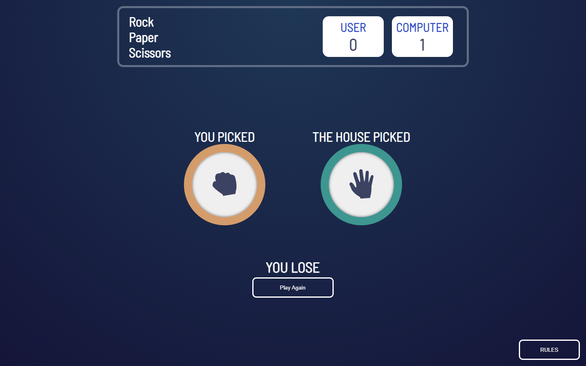

# Frontend Mentor - Rock, Paper, Scissors solution

## Table of contents

- [Overview](#overview)
  - [The challenge](#the-challenge)
  - [Screenshot](#screenshot)
  - [Links](#links)
- [My process](#my-process)
  - [Built with](#built-with)
- [Author](#author)

## Overview

### The challenge

Users should be able to:

- View the optimal layout for the game depending on their device's screen size
- Play Rock, Paper, Scissors against the computer
- Maintain the state of the score after refreshing the browser _(optional)_

### Screenshot

### Links

- [Solution](https://www.frontendmentor.io/challenges/rock-paper-scissors-game-pTgwgvgH)
- [Live site](https://arturharutyunyan1.github.io/rock-paper-scissors/)

## My process

### Built with

- Semantic HTML5 markup
- CSS custom properties
- Flexbox
- JavaScript
- Mobile-first workflow

## Author
- Frontend Mentor - [@ArturHarutyunyan1](https://www.frontendmentor.io/profile/ArturHarutyunyan1)

